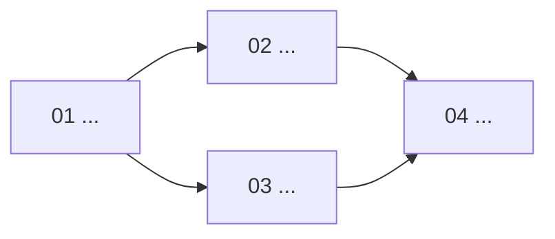

# PROMPT_CREATE_FEATURE — Generate a lean feature plan under your session

You are a code agent (Claude Code / Cursor / Codex) running at the **root of a workspace**. Execute this file as your complete task spec. You will **plan a feature** — you write planning documents only, **never product code**.

The trigger supplies `USER: <username>`. Every planning file you write goes under `.agentic_planning/<USER>/`. If that directory does not exist, stop and tell the operator to run trigger 0 (open session) first. **Never write into another user's session directory** or read another user's plans to inform this one. The only later exception is the mandatory route-5 close invoked by this plan's final executing step; it enumerates session paths for the shared index but writes only this user's row.

Treat the free text after "Feature to build:" in the trigger as the feature intent. If it is empty or one ambiguous line, ask up to **3** crisp clarifying questions before planning; otherwise proceed.

---

## Goal

Produce a small, executable plan under `.agentic_planning/<USER>/_feature_<slug>/`: a **short set of self-contained single-session steps with explicit dependencies, each launched by its own trigger — steps without a dependency edge between them are planned to run in parallel**. The plan shows its execution graph (Mermaid) and every step carries a one-line suggested model effort. **Steps that write product code carry binding test cases derived from the feature contract and must pass the subproject's declared quality gates — deterministic commands with exit codes, from `WORKSPACE_MAP.md` — before they may finish.** There are no verification cycles, no evaluators, no rubrics, no remediation loops and no evidence trees — machines verify correctness through the gates; **acceptance QA is done manually by the user** after the steps finish, guided by a checklist you write into the feature doc. In one line: correctness belongs to machines; acceptance belongs to the user.

## Inputs — read before planning

1. **`WORKSPACE_MAP.md`** at the workspace root. If it is missing, stale for touched subprojects, lacks Quality gates, **or lacks the `Existing docs & planning` global-close entry**, stop and direct the operator to `PROMPT_INIT.md` (trigger 1). Ground commands/cwd, gates, rules, contracts, access modes, seams, recipes, libraries, conventions and user-facing language in it.
2. **`CLAUDE.md` / `AGENTS.md`** (root and per-module) — layer conventions. Non-negotiable.
3. **`agentic-planning-kit/TRIGGERS.md` route 5** and `PROMPT_INIT.md`'s `RECONCILE_FEATURE` mode — the required close protocol this plan must embed in its final step.
4. **Your own prior features** under `.agentic_planning/<USER>/`, if any — match their document style.

## The method

A feature lives in `.agentic_planning/<USER>/_feature_<slug>/`:

```text
_feature_<slug>/
├── FEATURE_<SLUG>.md   # canonical doc: scope, binding contract, decisions, graph, manual QA checklist
├── TRIGGERS.md         # one launcher per step; the final one invokes route 5 in-process
├── steps/
│   ├── 01-<slug>.md    # step files — single-session, explicit dependencies
│   └── NN-<slug>.md
└── outputs/            # one short report per step (created by the executing sessions)
```

Four files and two directories. There is no per-feature README: the index table and the execution graph live in `FEATURE_<SLUG>.md` §4, once, and nothing mirrors them.

Binding principles:

- **1 step = 1 agent session.** Each step declares dependencies, and no edge means parallel by default. Serialize only for overlapping writes or a map `exclusive` resource (including gates). The human schedules sessions: additionally, routes 0/5 are workspace-global exclusive resources, so do not run those close/index phases concurrently in one checkout. No orchestrator, wave scripts or machine-readable DAG.
- **Execution graph, human-readable.** `FEATURE_<SLUG>.md` §4 shows the dependency graph as a **Mermaid diagram** (parallel branches side by side) plus a `Depends on` column, and states in one line which steps may launch simultaneously and why that is safe (disjoint writes + disjoint exclusive resources, gates included). This *replaces* — never reintroduces — `execution-dag.json`.
- **Suggested model effort per step.** Every step file carries a one-line `Suggested model effort`: a relative tier (`low` | `medium` | `high`) plus concrete examples for the three agent CLIs the operator uses — **Claude Code** (model + thinking effort), **Codex** (model + reasoning effort), **Cursor** (mode). It is a hint for the human launching the session, not routing machinery: no matrices, no per-step option tables, no fallback chains.
- **Few steps.** Prefer 2–6. Split by subproject and cohesive concern; merge steps that a single ordinary session can finish. A tiny feature may be 1 step.
- **Every step is self-contained** and starts with "Before any code, read …": the relevant `WORKSPACE_MAP.md` sections, the layer `CLAUDE.md`/`AGENTS.md`, and only the prior step reports it actually needs. A step may only require reports from its declared dependency edges — requiring a report from a parallel branch is a hidden edge (declare it or drop it).
- **One subproject per product-writing step.** Cross-subproject features get one step per subproject, in dependency order — which is exactly what makes cross-subproject branches parallelizable once the shared contract step lands. Each step passes only *its* subproject's gates.
- **Contracts are defined once** in `FEATURE_<SLUG>.md` §3 and mirrored by steps, never re-derived. A step that finds a mismatch shouts it at the top of its report and stops.
- **Binding test cases are planned, not improvised.** For every step that writes product code, derive from the contract (§3) the concrete cases its tests must cover — happy path, negative and edge cases — and write them into the step's `Binding test cases` section. The executing session implements tests for exactly those cases; **it may add cases, never remove or weaken them**. This separation — the planner sets the bar in one session, the executor meets it in another — is what keeps the gauntlet honest.
- **Gates, not agentic QA.** A step that writes product code must, **before writing its handoff report**: (1) implement its binding test cases; (2) run every applicable gate from the map's Quality gates table for its subproject; (3) record each gate command + exit code in the report. A gate failing because of the step's own change is fixed **in the same session**; a failure unrelated to the change stops the step, which reports it — no fix loops beyond the session, no evaluator sessions. Steps that write no product code (docs, planning, pure config) skip gates entirely.
- **The gauntlet never weakens.** No step may delete, skip, `xfail`/disable or loosen an existing test unless `FEATURE_<SLUG>.md` §3 explicitly changed the contract that test encodes — and then the step must say so in its report. **Every test file touched is listed in the report**, so the operator can audit the diff over tests in seconds without reading product code.
- **MISSING gates degrade loudly.** If a needed gate is `MISSING` in the map for a touched subproject, the plan either adds an explicit tooling-bootstrap step (installing/configuring the gate is then that step's whole scope) or records the degradation and its reason in `FEATURE_<SLUG>.md` §6 — never silently. Do not invent gates the map doesn't declare; do not require coverage thresholds, mutation testing or BDD runners.
- **Imitate, don't invent.** Each step names the seam (`file:symbol`, map §8), the recipe + exemplar (map §9) and the blessed library (map §2) it follows. No second way to do what already has a way.
- **Scope discipline.** The feature doc has an explicit *Out of scope*. A step that needs something out of scope stops and reports.
- **Data-store safety.** Respect each store's access mode from the map. Migrations run only against local/dev, never production. Read-only/sealed stores get no mutation plan of any kind.
- **Short handoff reports, nothing else.** Each step writes `outputs/NN_<slug>.md` (≤40 lines: changed files, gate results/exit codes, tests, decisions, next-step notes). A final report reserves exactly four lines: `## Cierre` plus three results. No `tests/`, `evals/`, `fixes/`, cache/cycle dirs, manifests, scorecards or JSON.
- **Mandatory close/reconcile.** The final step is a join that depends on every other terminal step; if no natural join exists, add one non-code close step within the 2–6 limit. After gates it writes its preliminary handoff, then automatically invokes root route 5 `RECONCILE FEATURE` in the same session with `USER` and `FEATURE_PATH`, filling the reserved close block before success; it is not a human launcher or graph node. Route 5 updates changed factual map sections plus the `Existing docs & planning` pointer, refreshes pointers, rebuilds `.agentic_planning/README.md` and marks execution complete (QA remains pending). Those artifacts are `exclusive`; if close fails, the step reports the blocker and remains unclosed.
- **Session and global index registration.** `.agentic_planning/<USER>/SESSION.md` is the source index for that user; planning adds its newest-first `## Features` row as `📝 Diseñada`, and route 5 alone flips it to `✅ Ejecutada (YYYY-MM-DD)` after reconciliation. `.agentic_planning/README.md` is the generated, deterministic global navigation index of all direct-child sessions; it never becomes a second source of truth. Flip any superseded row of yours while planning.
- **Manual QA checklist for the user.** `FEATURE_<SLUG>.md` §7 lists concrete actions + expected results the user performs by hand (app screens, API calls, DB queries), written **in Spanish** (user-facing). This replaces every automated *acceptance* artifact. The checklist focuses on what gates cannot prove — UX, device flows, visuals, end-to-end acceptance — and need not re-test correctness the binding test cases already cover.
- Explicitly **do not generate**: `planning-basis.json`, `execution-dag.json`, model-routing matrices, work-class tags, acceptance rubrics, evaluator/remediation/replan steps, roadmap/readiness-ledger nodes, `HUMAN_VERIFICATION.md`, orchestrator/wave scripts, coverage thresholds or enforcement (record the figure only when a gate already emits it), mutation-testing requirements, BDD-runner setup, or any JSON artifact at all. The Mermaid graph, one-line effort hint, binding cases/gates and mandatory in-process route-5 close are the only scheduling/routing/verification artifacts.

## Procedure

1. **Parse the intent.** Restate the feature in one sentence. Derive `<slug>` (kebab-case, ≤4 words) and `<SLUG>` (UPPER_SNAKE). If `.agentic_planning/<USER>/_feature_<slug>/` already exists, stop and ask whether to supersede it or pick another slug.
2. **Scope against the map.** Identify the touched subproject(s), the seams/recipes/blessed libs per subproject, **the Quality gates table per touched subproject** (note any `MISSING` gate now — it becomes a bootstrap step or a §6 degradation note), and what is explicitly out of scope. Check data-store access modes for anything the feature writes.
3. **Write `FEATURE_<SLUG>.md`** using the template below (≤200 lines). §3 (contract) is the spine — be concrete: the binding test cases of every code step derive from it.
4. **Decompose into 2–6 single-session steps and assign dependencies for maximum safe parallelism**: check candidate-parallel pairs for overlapping writes and shared exclusive resources (including gates). Make the final step depend on every terminal branch; if none naturally joins them, add a non-code close step. For each code step, derive §3's happy/negative/edge cases and write the step file (≤60 lines).
5. **Write `TRIGGERS.md`** — one launcher per step, grouped by parallel level; append route 5 inside the final launcher after its preliminary report and before successful completion.
6. **Register the feature in `.agentic_planning/<USER>/SESSION.md`**: insert its row at the top of `## Features` as `📝 Diseñada` with its one-line description and impacts; flip any superseded row of yours. Route 5, not the planner, performs the final `✅ Ejecutada` update.
7. **Print a summary**: slug, step list with dependencies/parallel groups, touched subprojects, gates per step, and assumptions.

---

## Template — `FEATURE_<SLUG>.md`

````markdown
# Feature: <short title> — <one-line subtitle>

**Canonical feature document.** <2–4 sentences: what it delivers and what it explicitly does not do.>

**Status:** design approved, pending execution.
**Owner session:** `.agentic_planning/<USER>/`
**Launchers:** [`TRIGGERS.md`](./TRIGGERS.md)

## 1. Motivation
<The why, numbered and brief. Ground in real files/behavior from WORKSPACE_MAP.md.>

## 2. Scope
| Subproject / layer | Change |
|--------------------|--------|
| ...                | ...    |

**Out of scope (not built):** <explicit list.>

## 3. Canonical contract
**Binding.** Steps code against it and never redefine it. The binding test cases of every code step derive from this section.
<Concrete enums, schemas, validation rules, derivation tables. Specific, not hand-wavy.>

## 4. Steps

| # | Step | Subproject | Depends on | Suggested effort | Gates | Writes | Report |
|---|------|-----------|------------|------------------|-------|--------|--------|
| 01 | ... | ... | — | medium | <map gates or `n/a (no product code)`> | ... | `outputs/01_<slug>.md` |



<one line: which steps may run in parallel (e.g. "02 ∥ 03 after 01") and why it is safe — disjoint write scopes + disjoint exclusive resources, gate commands included; state gate-run staggering when needed.>

## 5. Fixed design decisions
1. <decision + why, so an executing agent doesn't relitigate it.>

## 6. Invariants and anti-patterns
1. **The gauntlet never weakens:** no existing test is deleted, skipped or loosened; the only exception is an explicit contract change in §3, which the step must report. Every test file touched appears in the step report.
2. <must stay true across all steps — include the workspace map's hard rules that this feature touches.>
<if a needed gate is MISSING in the map and no bootstrap step was added: record the degradation and its reason here, visibly.>
- Anti-pattern: <a tempting wrong turn to avoid.>

## 7. QA manual (usuario)
<En español. Lista concreta de acciones + resultado esperado, ejecutable a mano por el usuario al terminar todos los pasos: pantallas, llamadas API, queries. Sin automatización. Enfocada en aceptación — UX, flujos en dispositivo, resultado visual — no en la corrección que los gates y los test cases vinculantes ya probaron.>

| # | Acción | Resultado esperado |
|---|--------|--------------------|
| 1 | ...    | ...                |

## 8. References
| Topic | Location |
|-------|----------|
| Workspace map | `WORKSPACE_MAP.md` |
| Quality gates | `WORKSPACE_MAP.md` §4 (touched subprojects) |
| Recipe(s) followed | `WORKSPACE_MAP.md` §9 + exemplar `file` |
| <contract/seam> | `file` |

_Created: <month year>. Origin: <one line>._
````

## Template — a step file `steps/NN-<slug>.md`

````markdown
# NN — <step title>

## Goal
<What this single session produces.>

## Depends on
<step numbers whose reports this step needs, or `none`. Steps not on this list run in parallel with this one.>

## Suggested model effort
<tier + one example per CLI, one line — e.g. `medium — Claude Code: Sonnet (thinking medium) · Codex: gpt-5-codex (reasoning medium) · Cursor: Auto`. A hint for the operator, not a requirement.>

## Before any code, read
- `WORKSPACE_MAP.md` — <the specific sections/subproject this step needs, always including its Quality gates table when this step writes product code>.
- <layer `CLAUDE.md`/`AGENTS.md`>.
- `../FEATURE_<SLUG>.md` §3 (binding contract) <+ other sections if needed>.
- <`../outputs/NN_*.md` prior reports actually needed, or `none`>.

## Subproject
<exactly one; its cwd and commands from the map.>

## Spec
<What to build. Name the seam `file:symbol`, the recipe + exemplar file, the blessed library. Concrete and bounded.>

## Binding test cases
<Code steps only — write `not applicable (no product code)` otherwise. The concrete cases this step's tests MUST cover, derived from FEATURE §3: happy path, negative, edge. The executor may add cases, never remove or weaken these.>
1. <case — input/state → expected outcome>
2. <case>
3. <negative/edge case>

## Out of scope
<what this step must NOT touch.>

## Gates
<Code steps: mandatory before the report. Non-code steps: `not applicable`.>
<The subproject's Quality gates commands from the map, verbatim + cwd. Run them after implementing the spec and the binding test cases; record each command + exit code in the report. A failure caused by this step's change is fixed in this session; a failure unrelated to it stops the step — report, do not fix. Never delete, skip or loosen an existing test to pass a gate.>

## Deliverables
- <product files/paths>.
- <code steps> tests implementing the binding test cases above, in the subproject's declared test location/style.
- `outputs/NN_<slug>.md` — short handoff report (≤40 lines): what changed, files touched, **gate results (command + exit code)**, **tests added (one-line claim each) + test files touched**, decisions, notes for the next step.
- <final step only> end this ≤40-line preliminary report with `## Cierre` plus three placeholders; invoke root route 5 with `USER: <USER>` and `FEATURE_PATH: .agentic_planning/<USER>/_feature_<slug>/`, then replace those three lines with its map/pointer/index/status result. Do not end successfully if it fails.
````

## Template — `TRIGGERS.md`

One launcher **per step**, in dependency order. No orchestrator block or cycle launchers. Group parallel branches (e.g. "after 01, launch 02 and 03 together"); the final launcher is the join and contains the mandatory in-process route-5 close.

````markdown
# Agent session triggers — launch in dependency order; steps in the same parallel group may run simultaneously

## 01 — <step title>

```text
Read .agentic_planning/<USER>/_feature_<slug>/steps/01-<slug>.md and execute it as your complete task spec.
Start at the workspace root. Before any code, read WORKSPACE_MAP.md, the layer CLAUDE.md/AGENTS.md it names, and the prior reports it lists. Write only within the step's declared scope. If the step writes product code: implement its binding test cases, then run its Gates commands and record each command + exit code in the report; never delete, skip or loosen existing tests to pass. Write outputs/01_<slug>.md (≤40 lines), ending with `## Cierre` plus three placeholders if 01 is terminal; then append the mandatory terminal suffix below when it is terminal.
```

## NN — <step title>

```text
Read .agentic_planning/<USER>/_feature_<slug>/steps/NN-<slug>.md and execute it as your complete task spec.
Start at the workspace root. Before any code, read WORKSPACE_MAP.md, the named CLAUDE.md/AGENTS.md and required reports. Write only the declared scope. If this step writes product code, implement its binding cases, run every Gate and record each command + exit code. Write `outputs/NN_<slug>.md` (≤40 lines), ending with `## Cierre` plus three placeholders if terminal; then append the mandatory terminal suffix below when it is terminal.
```

**Mandatory terminal suffix — append this verbatim to whichever launcher is final, including `01`:**

```text
Automatically invoke route 5 `RECONCILE FEATURE` in this same session: read `agentic-planning-kit/PROMPT_INIT.md`, execute `MODE: RECONCILE_FEATURE`, `USER: <USER>`, `FEATURE_PATH: .agentic_planning/<USER>/_feature_<slug>/`. Do not ask the user to launch it. Keep `## Cierre` and replace its three placeholder lines with map/pointer, index and status results; do not finish successfully if it fails.
```

After the successful closed last step, the user performs `FEATURE_<SLUG>.md` §7 manual QA. A defect becomes a new ad-hoc fix request or small feature plan — no automated remediation loop.
````

## Template — the `## Features` row in `.agentic_planning/<USER>/SESSION.md`

The planner edits only its own session file, inserting features at the top and flipping superseded rows. Routes 0/5 regenerate the global index; root route 5 is its sole feature-close reconciler and writer of `✅ Ejecutada`. User-facing prose is Spanish.

````markdown
## Features

**Status:** ✅ Ejecutada · 🔄 En ejecución · 📝 Diseñada (pendiente de ejecución) · ⛔ Superseded · 📌 Documento vivo.

| Documento | Qué hace | Impacta | Status | Fecha |
|---|---|---|---|---|
| [<slug>](./_feature_<slug>/FEATURE_<SLUG>.md) | <una línea> | <subproyectos> | 📝 Diseñada | YYYY-MM-DD |
````
