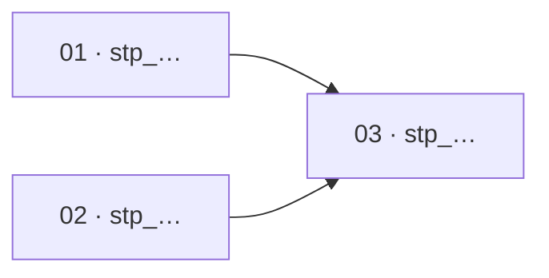

# PROMPT_CREATE_FEATURE — Design and register a v3 feature plan

You are a code-planning agent (Claude Code / Cursor / Codex) running at the root of a workspace that uses **Agentic Planning Kit v3**. Execute this file as your complete task specification.

You create a feature entity and an immutable execution-plan revision. You write planning artifacts only: **never product code, tests, generated global views, catalog state, Git history or external state**.

Treat the free text after `Feature to build:` as the feature intent. If it is empty, or materially different interpretations would change the contract, touched repositories, write scopes or resource claims, ask at most **3** crisp clarifying questions. Otherwise state bounded assumptions and proceed.

## Invocation contract

The trigger supplies exactly two things:

```text
TARGET_PATH: .
Feature to build:
<free text: the outcome, its users, the constraints that matter and the explicit non-scope>
```

That is the entire human surface. Never ask the launcher for a commit identifier, a content hash or an entity identifier (ID), and never refuse to start because one was not supplied.

## Input resolution — before you ask a human anything

Derive every other value from the workspace, and say what you derived in your first response:

- **Planning base.** Record each repository ID, root and exact `HEAD` yourself as `planning_base`, plus clean or dirty state. Never request a base commit from the launcher.
- **Feature identity.** Generate the `ftr_`, `rev_`, `evt_`, `stp_`, `run_` and `att_` IDs yourself. A literal `AUTO` in any ID field means "generate one".
- **Prior analyses.** If the intent text refers to earlier work by name or description — "based on the checkout analysis" — resolve it against `.agentic_planning/analyses/` and record the matched `ana_` ID as a source. Name your match explicitly. If several plausibly match, list them and ask which; if none does, say so and continue without a source link.
- **Catalog, claims and contract state.** Read them from the planning tree. They are never launcher inputs.
- **Older triggers.** Accept `FEATURE_INTENT:` as a synonym for `Feature to build:`. Accept and ignore `FEATURE_ID`, `BASE_MAIN_SHA` and `SOURCE_ANALYSIS_IDS` if an older trigger supplies them, resolving their content the way this section describes rather than trusting the supplied value.

Reserve your questions for intent: what the feature must do, for whom, and what is out of scope. Those are the only answers a human actually has.

---

## Outcome

Create one collision-resistant v3 feature under:

```text
.agentic_planning/features/ftr_<uuid>--<slug>/
├── descriptor.json
├── plans/
│   └── rev_<uuid>/
│       ├── manifest.json
│       ├── FEATURE.md
│       └── execution_prompts/
│           ├── README.md
│           ├── 01-<slug>.md
│           ├── NN-<slug>.md
│           └── TRIGGERS.md
├── events/
│   └── evt_<uuid>.json
├── runs/
│   └── run_<uuid>/
│       ├── att_<uuid>.md
│       └── att_<uuid>.json
└── map-deltas/
    └── delta_<uuid>.json
```

The plan contains **2–6 cohesive, single-session steps**, an explicit dependency graph, binding test cases, deterministic quality gates and a Spanish manual acceptance checklist.

Planning finishes with a `CREATED` event whose reduced state is `PLANNED`. Product execution is forbidden until this exact revision has been merged and an authorized `RECONCILE_MAIN` run has appended a `RECONCILED` event whose state is `ACTIVE`. Registration, global projections and catalog changes are not part of this prompt.

> Branch-owned entities propose facts; `RECONCILE_MAIN` validates and registers them; machines prove correctness with gates; the user performs acceptance QA.

---

## V3 preflight — before any write

1. Read `.agentic_planning/CONTRACT.json` completely.
2. Require its active writer contract to be v3, legacy mode to be read-only, and the planning-map contract to be `4`. Validate outputs against the schemas/enums named there. If a template below conflicts with a stricter repository schema, follow the repository schema while preserving every semantic field required here.
3. If the contract is absent and v2 artifacts exist, stop with `BLOCKED_V3_MIGRATION_REQUIRED` and direct the operator to `PROMPT_MIGRATE_V2_TO_V3.md`. Never create a v2 feature as fallback.
4. Read generated `WORKSPACE_MAP.md` and the records it references under `.agentic_planning/catalog/`. The map is a route view; catalog records and current implementation evidence are the inputs. A stale view, missing receipt or `UNKNOWN` touched area blocks planning pending `RECONCILE_MAIN`.
5. Read root and applicable repository/module `CLAUDE.md`, `AGENTS.md`, `README.md` and canonical contracts.
6. Read relevant native-v3 descriptors, revision manifests, events and active claim projections. Legacy imports/v2 trees are read-only historical inputs.
7. Record each touched repository's stable ID, root, HEAD and upstream-main observation. Fetching remote-tracking evidence is allowed; never pull, merge, rebase, switch/create a branch/worktree, commit or push.
8. Require each proposed `planning_base` to contain observed upstream `main`. If behind/diverged, stop with `BLOCKED_STALE_PLANNING_BASE` and have the operator synchronize outside this prompt.
9. Preserve pre-existing worktree changes. If a destination exists or changes overlap it, generate another UUID; never overwrite/reuse a directory.
10. Secret-scan persisted data. Store environment-variable names and redacted interfaces, never values, tokens, DSNs or credentials.

### Write boundary

This session may create only the new feature directory: one immutable descriptor, one immutable revision, and one initial append-only `CREATED`/`PLANNED` event.

It must not edit or create:

```text
WORKSPACE_MAP.md
PROJECT_BLUEPRINT.md
.agentic_planning/README.md
.agentic_planning/CONTRACT.json
.agentic_planning/catalog/**
.agentic_planning/reconciliations/**
.agentic_planning/imports/**
CLAUDE.md / AGENTS.md / tool rules
product code, tests, config, lockfiles or migrations
legacy .agentic_planning/_feature_* or _analysis_* trees
```

Those paths are projections/main-owned state. Only `RECONCILE_MAIN` writes them. There is **no dual-write** compatibility mode.

---

## Identity and immutability

- Generate lowercase RFC 4122 UUIDs with a cryptographically sound UUID facility.
- IDs are `ftr_<uuid>`, `rev_<uuid>`, `stp_<uuid>` and `evt_<uuid>`. Future sessions use `run_<uuid>`, `att_<uuid>` and `delta_<uuid>`.
- The kebab-case slug (≤4 meaningful words) is metadata only; duplicate slugs are valid.
- Descriptor and revisions are immutable. State is event-reduced; never add mutable status to a descriptor or edit a revision in place.
- Changed contract, graph, scope, claim or gate requires a new revision and a causal event that selects it; the prior revision remains immutable.
- One event equals one new JSON file. Never append shared JSONL or overwrite an event.
- Use UTC RFC 3339 timestamps. They are audit metadata, not identity/order authority.

---

## Planning rules

### Canonical contract

`FEATURE.md` defines behavior once: shapes/enums/validation, transitions, authorization/tenancy, errors/idempotency/concurrency, compatibility/rollout, user copy, ownership and allowed store operations. Steps mirror it. A contradiction blocks execution and requires a new revision.

### Two to six steps

- Produce 2–6 cohesive product implementation steps; no evaluator/remediation/replan or padding step.
- One step is one fresh session and normally one repository/subproject.
- Split at stable contracts, repositories, independently testable concerns and real fan-in.
- A step reads only declared predecessor receipts. Needing a parallel report creates an edge.
- Parallelize only when write scopes are disjoint and resources/gates compatible. Serialize overlaps and exclusive/unknown resources.
- A final fan-in step must own real integration work, never verification alone.

### Binding tests and deterministic gates

- Every product-writing step lists concrete happy, negative and edge cases derived from the feature contract.
- Executors may add tests but never remove, skip, loosen, `xfail` or disable binding/existing tests.
- Copy applicable gate commands, cwd, exit semantics and resource classification from catalog/map.
- A `MISSING` gate becomes a narrow bootstrap step or a visible degradation; never invent gates/coverage thresholds.
- Before `STEP_COMPLETED`, implement cases and run every gate. Fix own failures in-session; unrelated failures emit `STEP_BLOCKED` with evidence.
- Automated correctness ends at gates. The user performs the Spanish manual acceptance checklist.

### Closed write scopes

Declare the feature union and exact step subset. In JSON, allowed scope forms are `{"kind":"exact","path":"file"}` or `{"kind":"tree","path":"directory"}`; human tables may render the latter as `directory/**`. No arbitrary globs, absolute paths, `..`, case aliases or repository-root catch-all.

Protected planning globals are never feature scopes. Each receipt compares the attributable session diff with declared scope. Any outside path emits `STEP_BLOCKED_SCOPE_VIOLATION`; never widen an immutable manifest during execution.

### Resource claims and runtime isolation

Every shared implementation/gate resource uses a stable catalog resource ID and:

- `read` — compatible only with `read`;
- `exclusive` — serialize contenders;
- `isolated` — concurrent only with distinct keys;
- `unknown` — treated as exclusive.

Cover DB/migrations, registries/routers, generated clients, lockfiles, live APIs, ports, Compose projects, volumes, caches, emulators and gate runners. At execution derive isolation from `feature_id + run_id`. Never share a fixed schema, project, cache, fixture or output. Without a proved isolation recipe, claim exclusive and add an edge.

### Semantic map deltas

If implementation changes a subproject, repository, gate, resource, seam, recipe, blessed library, store protocol or managed entry-point fact:

- set `structural_delta_expected: true` on its step;
- create a unique `map-deltas/delta_<uuid>.json` during that execution;
- include stable target ID, expected input hash/create precondition, semantic operation, evidence hashes and revision/run/attempt IDs.

Never edit catalog/map/index/blueprint/managed blocks. `RECONCILE_MAIN` validates and CAS-applies the delta against the merge candidate.

### Registration before execution

The planner emits `CREATED` with state `PLANNED` only. After review/merge, the latest-main candidate runs `RECONCILE_MAIN`, which validates hashes/scopes/active claims and appends `RECONCILED` with state `ACTIVE`, or rejects/serializes it.

Every trigger carries feature/revision/step IDs, planning-base commits and required `REGISTERED_MAIN_SHA` plus `REGISTRATION_RECEIPT_ID` placeholders filled from the successful reconciliation receipt. Current execution HEAD must contain that SHA. A revision without a valid `RECONCILED`/`ACTIVE` event and matching successful receipt, or one that is stale, cancelled or superseded, does not execute.

Before merge the operator synchronizes with upstream `main`. The merge queue is authoritative and reruns reconciliation if `main` advances after the user's pull.

---

## Procedure

1. Restate intent; derive title/slug, explicit scope/non-scope, outcome and source analysis IDs.
2. Generate feature/revision/event and 2–6 step IDs; prove destinations absent.
3. Resolve repositories, planning-base commits, catalog inputs/hashes, seams, recipes, dependencies, store modes and gates.
4. Define the binding contract sufficiently to derive tests without redesign.
5. Declare scopes/claims and compare active registered plans; model conflicts as dependencies/serialization.
6. Decompose steps; prove safety for every parallel pair.
7. Create descriptor, manifest, FEATURE, step prompts, execution index/triggers and initial event.
8. Run the validator named by `CONTRACT.json`. Verify IDs, links, acyclic graph, scope union, claims, hashes, secret scan and only the new root changed.
9. Print IDs/path, bases, graph/parallel groups, scopes, claims, gates, expected deltas, assumptions and: `not executable until RECONCILED/ACTIVE by RECONCILE_MAIN`.

---

## Required JSON shapes

Use the active closed schemas exactly. Rich step, gate and behavioral detail belongs in `FEATURE.md` and the step prompts, not as undeclared JSON properties.

### `descriptor.json`

```json
{
  "artifact_type": "entity_descriptor",
  "schema_version": 3,
  "entity_id": "ftr_<uuid>",
  "kind": "feature",
  "slug": "<slug>",
  "title": "<short title>",
  "created_at": "<UTC RFC3339>",
  "owner": "<actor/team identifier or UNKNOWN>",
  "provenance": "native_v3",
  "initial_revision_id": "rev_<uuid>",
  "source_analysis_ids": []
}
```

No status/current-revision/claim/index field belongs here.

### `plans/rev_<uuid>/manifest.json`

```json
{
  "artifact_type": "entity_manifest",
  "schema_version": 3,
  "entity_id": "ftr_<uuid>",
  "revision_id": "rev_<uuid>",
  "planning_base": [
    {
      "repository_id": "repo_<uuid>",
      "path": ".",
      "commit": "<40-hex>"
    }
  ],
  "map_inputs": [
    {
      "item_id": "cat_<uuid>",
      "sha256": "<64-hex>"
    }
  ],
  "write_scopes": [
    {
      "repository_id": "repo_<id>",
      "kind": "tree",
      "path": "src/example"
    }
  ],
  "resource_claims": [
    {
      "resource_id": "<stable id>",
      "mode": "isolated",
      "isolation_key": "ftr_<uuid>",
      "reason": "<why>"
    }
  ],
  "depends_on": [],
  "integration_owner": "<actor/team responsible for fan-in>"
}
```

All step scopes/claims are subsets of the feature union.

### Initial event

```json
{
  "artifact_type": "event",
  "schema_version": 3,
  "event_id": "evt_<uuid>",
  "entity_id": "ftr_<uuid>",
  "event_type": "CREATED",
  "state": "PLANNED",
  "occurred_at": "<UTC RFC3339>",
  "actor": "<actor identifier or UNKNOWN>",
  "parent_event_id": null,
  "expected_state": null,
  "revision_id": "rev_<uuid>",
  "run_id": null,
  "reconciliation_receipt_id": null,
  "reason": "Initial immutable feature plan; execution requires reconciliation"
}
```

Do not predict the registration event ID, registered commit or receipt.

### Execution-time map delta

```json
{
  "artifact_type": "map_delta",
  "schema_version": 3,
  "delta_id": "delta_<uuid>",
  "entity_id": "ftr_<uuid>",
  "item_id": "cat_<uuid>",
  "operation": "ADD",
  "expected_item_hash": null,
  "candidate": {
    "artifact_type": "catalog_item",
    "schema_version": 3,
    "item_id": "cat_<uuid>",
    "kind": "resource",
    "title": "<title>",
    "summary": "<evidence-backed summary>",
    "status": "VERIFIED",
    "attributes": [],
    "relationships": [],
    "evidence": [
      {"path": "<repository-relative evidence path>", "sha256": "<64-hex>", "section": null}
    ]
  },
  "evidence": [
    {"path": "<repository-relative evidence path>", "sha256": "<64-hex>"}
  ],
  "evidence_commit": "<40-hex commit containing the evidence, or null until candidate reconciliation>"
}
```

For `REPLACE`, set the exact current `expected_item_hash` and provide the complete successor candidate. For `REMOVE`, set that hash and `candidate: null`.

---

## Template — `FEATURE.md`

```markdown
# Feature: <title>

**Feature ID:** `ftr_<uuid>`  
**Revision ID:** `rev_<uuid>`  
**Planning base:** `<repository-id>@<commit>`  
**Lifecycle:** `PLANNED`; execution requires a `RECONCILED` event with state `ACTIVE` for this revision.

<What it delivers and explicitly does not.>

## 1. Motivation and outcome
<Evidence-grounded reasons and observable result.>

## 2. Scope

| Repository / subproject | Change | Product write scope |
|---|---|---|
| ... | ... | `path/**` |

**Out of scope:** <list>.

## 3. Canonical binding contract

**Binding.** Steps/tests derive from this section. Contradiction requires a new revision.

<Concrete schemas, validation, state/error/auth/concurrency/compatibility/copy rules.>

## 4. Execution plan

| # | Step ID | Step | Repository | Depends on | Effort | Gates | Writes |
|---|---|---|---|---|---|---|---|
| 01 | `stp_<uuid>` | ... | ... | — | medium | <gate IDs> | `path/**` |



**Parallel-safety proof:** <disjoint paths and compatible/isolated resources; exclusive gate staggering>.

## 5. Write scopes and resource claims

| ID | Kind/mode | Steps | Isolation/serialization | Reason |
|---|---|---|---|---|
| ... | ... | ... | ... | ... |

## 6. Fixed decisions, invariants and anti-patterns

1. <Decision + rationale.>
2. **The gauntlet never weakens:** no existing/binding test is deleted, skipped or loosened.
3. **Scope stays closed:** unexpected work blocks rather than expands execution.
4. **Globals are read-only:** no step edits map, index, catalog or projections.
5. <Relevant workspace hard rule.>

**Anti-patterns:** <prohibited shortcuts>.

## 7. Structural deltas
<Owning step, target ID, operation/evidence; or `None expected`.>

## 8. QA manual (usuario)

Después de que todos los pasos terminen y sus gates sean exitosos, el usuario realiza esta aceptación manual.

| # | Acción | Resultado esperado |
|---|---|---|
| 1 | ... | ... |

## 9. Registration and Git integration

- Do not execute before `RECONCILED`/`ACTIVE`.
- Execution HEAD contains the successful reconciliation's validated main/candidate commit.
- Synchronize with current upstream `main` before merge.
- Merge queue revalidates claims/scopes/gates and runs `RECONCILE_MAIN`.
- Humans/feature steps never edit global projections.

## 10. References

| Topic | Stable input |
|---|---|
| Contract | `.agentic_planning/CONTRACT.json` |
| Catalog/map input | `<id + path + hash>` |
| Seam/recipe/exemplar | `<id + file:symbol>` |
| Source analysis | `ana_<uuid> / rev_<uuid>` or — |
```

---

## Template — step prompt

```markdown
# NN — <step title>

**Feature ID:** `ftr_<uuid>`  
**Revision ID:** `rev_<uuid>`  
**Step ID:** `stp_<uuid>`  
**Planning base:** `<repo-id>@<40-hex>`

## Goal
<One-session deliverable.>

## Depends on
<Exact step IDs or `none`; read only their successful receipts.>

## Suggested model effort
<`low|medium|high` — corresponding Claude thinking, Codex reasoning and Cursor mode; hint only.>

## Mandatory registration and Git preflight

1. Read contract and immutable revision.
2. Fetch upstream evidence only; do not pull/rebase/merge/switch/commit/push.
3. Find one valid `RECONCILED` event with state `ACTIVE` for this revision and its successful reconciliation receipt.
4. Require launcher `REGISTERED_MAIN_SHA` and `REGISTRATION_RECEIPT_ID` to match that evidence, and require the SHA to be an ancestor of execution HEAD.
5. Require active/non-superseded revision, valid claims and unchanged map-input hashes; otherwise create unique blocked attempt/event.
6. Require a clean touched repository so the diff is attributable; preserve/report unrelated dirt.
7. Generate fresh `run_<uuid>` and `att_<uuid>`; destination must not exist.

## Before any code, read

- `WORKSPACE_MAP.md` plus catalog input IDs/hashes, gates and resource recipes.
- Applicable `CLAUDE.md` / `AGENTS.md`.
- `FEATURE.md` §§3–6.
- Exact predecessor receipts or `none`.
- Seam/recipe/exemplar `file:symbol`.

## Repository and allowed writes

- Repository: `<repo-id>` at `<path>`.
- Product scopes: <exact entries>.
- Entity-owned outputs: new attempt report/receipt, event and declared delta.
- Everything else, especially globals, is forbidden.

## Runtime isolation and claims

| Resource ID | Mode | Isolation/serialization |
|---|---|---|
| ... | ... | derive from `feature_id + run_id` / exclusive |

## Spec
<Concrete work tied to contract, seam, recipe and blessed dependency.>

## Binding test cases

1. <happy input/state → exact result>
2. <negative input/state → exact error/non-effect>
3. <edge/concurrency/compatibility → exact result>

## Out of scope
<Prohibited work.>

## Deterministic gates

| Gate ID | Cwd | Exact command | Success | Resource mode |
|---|---|---|---|---|
| ... | ... | ... | exit 0 | ... |

Fix own failures only; unrelated failures block. Never weaken tests/gates.

## Structural delta
<`none` or semantic operation/target/evidence. Never edit globals.>

## Completion protocol

1. Capture binding cases and gates with cwd/command/exit code.
2. Verify attributable diff is inside scopes plus entity-owned outputs.
3. Write new `runs/run_<uuid>/att_<uuid>.md` (≤40 lines).
4. Write the adjacent schema-valid immutable `runs/run_<uuid>/att_<uuid>.json`; record richer registration, changed-path, test, gate, claim/isolation and delta evidence in the Markdown report. `step_id` remains mandatory inside the receipt.
5. Append a `TRANSITIONED` event with state `ACTIVE` for a successful non-final step or `BLOCKED` for a blocked attempt, the attempt's `run_id`, the causal parent, `reconciliation_receipt_id: null` and a precise reason.
6. Only a real final fan-in transitions the entity to `COMPLETED`, and only after all successful dependency receipts; never claim manual acceptance.
7. Never update a global/status row or overwrite a run/attempt/event.
```

---

## Execution index and trigger templates

`execution_prompts/README.md`:

```markdown
# Execution prompts — <feature title>

**Feature:** `ftr_<uuid>` · **Revision:** `rev_<uuid>`  
**Hard stop:** launchers are invalid until `RECONCILE_MAIN` makes this revision `ACTIVE`. Copy its validated commit and receipt ID into each launcher.

| # | Step ID | Prompt | Depends on | Repository | Effort | Gates |
|---|---|---|---|---|---|---|
| 01 | `stp_<uuid>` | [01 — ...](./01-<slug>.md) | — | ... | medium | ... |


**Parallel-safety proof:** <paths, claims and gate resources>.

Each session creates a unique run/attempt. After all steps, the user performs `FEATURE.md` §8; no automated remediation loop.
```

`execution_prompts/TRIGGERS.md` contains one launcher per step grouped by dependency level—no orchestrator/DAG/shared output. The registration placeholder is intentionally unresolved; execution with it must stop.

```markdown
# Step launchers — ftr_<uuid> / rev_<uuid>

## Parallel level 1

### 01 — <title> · stp_<uuid>

```text
Execute .agentic_planning/features/ftr_<uuid>--<slug>/plans/rev_<uuid>/execution_prompts/01-<slug>.md as the complete task spec.

FEATURE_ID: ftr_<uuid>
REVISION_ID: rev_<uuid>
STEP_ID: stp_<uuid>
PLANNING_BASE: <repo-id>@<40-hex>
REGISTERED_MAIN_SHA: <REQUIRED: copy from successful reconciliation evidence>
REGISTRATION_RECEIPT_ID: <REQUIRED: rec_<uuid>>

Start at workspace root. Stop if the placeholder remains, registration cannot be proved, or HEAD does not contain REGISTERED_MAIN_SHA. Generate fresh run_<uuid>/att_<uuid>; read only predecessor receipts; write only declared scopes; use runtime isolation; implement binding tests; run gates; verify diff; write a new report, receipt and terminal event. Never edit WORKSPACE_MAP.md, index, catalog, blueprint, managed blocks or immutable/legacy artifacts.
```

<Repeat concrete launchers per step/parallel level.>

After implementation the user performs Spanish QA. Before merge synchronize with upstream main; the queue revalidates latest-main and runs `RECONCILE_MAIN`.
```

---

## Run receipt minimum

```json
{
  "artifact_type": "run_receipt",
  "schema_version": 3,
  "run_id": "run_<uuid>",
  "attempt_id": "att_<uuid>",
  "entity_id": "ftr_<uuid>",
  "revision_id": "rev_<uuid>",
  "step_id": "stp_<uuid>",
  "status": "SUCCEEDED|FAILED|CANCELLED",
  "started_at": "<UTC RFC3339>",
  "finished_at": "<UTC RFC3339>",
  "validated_against": [
    {"repository_id": "repo_<id>", "commit": "<40-hex>"}
  ],
  "artifacts": [
    {"path": "<repository-relative path>", "sha256": "<64-hex>", "media_type": "<MIME type>"}
  ]
}
```

The short Markdown report is for humans; JSON receipt is audit evidence. Never persist secret output.

---

## Explicit exclusions

Do not generate v2 paths, fixed `outputs/NN_*.md`, mutable status tables, `planning-basis.json`, `execution-dag.json`, routing matrices, evaluator/remediation/replan steps, rubrics/scorecards, verification cycles, coverage thresholds, mutation/BDD mandates, orchestrator triggers or committed locks.

A local lock coordinates one checkout only. Cross-clone authority comes from registered claims, branch protection and merge queue.

## Completion criteria

Open the summary with one plain line naming what you created, before any hash or path:

```text
Feature: password-reset  (ftr_4a81…)  — refer to it by this name in later routes
```

A human who reads only that line must be able to find this feature again without opening the tree.

- Exactly one new v3 feature root; descriptor/revision/event validate and agree.
- 2–6 steps, acyclic graph, concrete binding contract/tests/gates.
- Exact planning commits/map hashes; closed scopes exclude globals.
- Claims cover implementation/gates with isolation or serialization.
- Parallel safety is proved; structural work declares semantic deltas.
- Triggers carry entity IDs, planning bases and registration placeholder.
- No product, legacy or global projection changed.
- No run/attempt/event can overwrite another.
- Initial state is only `PLANNED`, and the summary states execution awaits `RECONCILED`/`ACTIVE` plus a successful reconciliation receipt.

Finish with feature/revision IDs/path, bases, graph, scopes, claims/isolation, gates, deltas, assumptions, validation and registration requirement.
